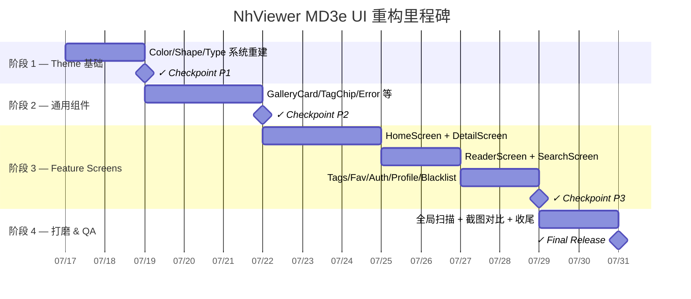

# NhViewer — Material Design 3 Expressive (MD3e) UI 重构实施计划

## 现状评估

经过对代码库 **10 个 Feature Screen**、**6 个 Common 组件**、**3 个 Theme 文件** 的全量审计，识别出以下系统性问题：

### 🔴 高优先级问题

| # | 问题 | 严重程度 | 影响范围 |
|---|---|---|---|
| 1 | **`TagChip` 大量硬编码颜色** — 94 行中包含 **14 个 `Color(0xFF...)`** 硬编码值，完全绕过 `MaterialTheme.colorScheme` | 高 | `DetailScreen`, `TagsScreen`, `SearchScreen` |
| 2 | **`fontSize = xx.sp` 直接字面量** — 全项目 80+ 处使用 `fontSize = 13.sp` / `11.sp` 等字面量，未使用 `MaterialTheme.typography` 语义化 token | 高 | **所有** Screen |
| 3 | **`RoundedCornerShape(8.dp)` / `12.dp` 硬编码** — 未使用 `MaterialTheme.shapes` 系统 | 高 | `GalleryCard`, `DetailScreen`, `HistoryCard`, `AuthScreen` |
| 4 | **`ReaderScreen` 使用 `Color.Black` / `Color.White` 硬编码** — 完全跳过主题系统 | 高 | `ReaderScreen` |
| 5 | **`SearchBar` `containerColor` 使用 `.copy(alpha = 0.5f)`** — alpha hack 导致不同主题下对比度不一致 | 中 | `SearchScreen` |
| 6 | **缺少 `crossfade(true)` 图片淡入** — `AsyncImage` 无任何加载动画，图片瞬间"闪现" | 中 | **所有** 使用 `AsyncImage` 的地方 |
| 7 | **缺少 `animateContentSize()` 过渡** — 所有条件渲染使用粗暴的 `if` 显隐，无任何过渡动画 | 中 | `DetailScreen`, `HomeScreen`, `ProfileScreen` |
| 8 | **`Spacer` 滥用** — 大量使用 `Spacer(Modifier.height/width)` 而非 `Arrangement.spacedBy()` | 低 | **所有** Screen |
| 9 | **`Theme.kt` 未设置 `shapes` 属性** — `MaterialTheme` 调用中完全缺失 `shapes` 参数 | 高 | 全局 |
| 10 | **缺失 Surface/Container 色彩分层** — 未使用 `surfaceContainer`, `surfaceContainerLow/High` 等 MD3 tonal surface 层级 | 中 | 全局 |

### 📊 文件影响统计

| 层级 | 文件数量 | 需要修改的文件 |
|---|---|---|
| `ui/theme/` | 3 | **全部** (Color.kt, Theme.kt, Type.kt) |
| `presentation/common/` | 6 | **全部** (GalleryCard, TagChip, ErrorScreen, EmptyState, LoadingIndicator, CaptchaWebView) |
| `presentation/feature/` | 20 (10 Screen + 10 ViewModel) | **10 个 Screen 文件**（ViewModel 不变） |
| `MainActivity.kt` | 1 | **需修改** (NavigationSuiteScaffold 参数优化) |
| `res/values/` | 3 | `themes.xml`, `colors.xml` 需清理 |
| **合计** | 33 | **20 个文件需修改** |

---

## 重构原则

> [!IMPORTANT]
> 本次重构 **不涉及任何业务逻辑、ViewModel、Data/Domain 层变更**。仅重构 UI 表现层（Composable 函数 + Theme 系统），确保零功能回归。

1. **语义化优先**：所有颜色 → `MaterialTheme.colorScheme.*`，所有字号 → `MaterialTheme.typography.*`，所有圆角 → `MaterialTheme.shapes.*`
2. **MD3 组件替代**：用 `FilterChip` 替代手写 `TagChip`，用 `ListItem` 替代手写 Row 布局
3. **动效升级**：`crossfade(true)` 图片淡入、`animateContentSize()` 尺寸过渡、`AnimatedVisibility` 条件渲染
4. **8dp 栅格系统**：统一 `4.dp`, `8.dp`, `12.dp`, `16.dp`, `24.dp` 间距
5. **色彩分层**：`background` → `surface` → `surfaceContainer` → `surfaceContainerHigh` 拉开视觉层级

---

## 阶段 1：Theme 基础设施重建 (Foundation)

**预估工期：1–2 天**

### 目标
构建完整的 MD3 设计系统基础，使后续所有 Screen 的重构有统一的设计 token 可用。

### 任务清单

#### 1.1 [MODIFY] [Color.kt](file:///f:/dev/nhentai/app/src/main/java/com/example/nhviewer/ui/theme/Color.kt)

- 使用 Material Theme Builder 或 `ColorScheme` 标准 40 色槽重新定义完整色板
- 补充缺失的 tonal surface 层级色：`surfaceContainerLowest`, `surfaceContainerLow`, `surfaceContainer`, `surfaceContainerHigh`, `surfaceContainerHighest`
- 补充 `inverseSurface`, `inverseOnSurface`, `inversePrimary`
- 确保 Light / Dark 两套色板均完整覆盖 MD3 ColorScheme 的全部 slot
- 保留品牌玫红主色 `RosePrimary` 作为 seed color 派生色系

#### 1.2 [MODIFY] [Theme.kt](file:///f:/dev/nhentai/app/src/main/java/com/example/nhviewer/ui/theme/Theme.kt)

- `MaterialTheme` 调用增加 `shapes = NhViewerShapes` 参数
- 考虑引入 `dynamicColorScheme` 支持（API 31+ 动态取色）+ fallback 到自定义色板
- 确保 `NhViewerTheme` 暴露完整的 `colorScheme`, `typography`, `shapes` 三件套

#### 1.3 [NEW] `Shape.kt` — 新增形状系统

```
ui/theme/Shape.kt
```

- 定义 `NhViewerShapes` 对象，覆盖 `extraSmall (4.dp)`, `small (8.dp)`, `medium (12.dp)`, `large (16.dp)`, `extraLarge (28.dp)`
- 符合 MD3 Shape 规范

#### 1.4 [MODIFY] [Type.kt](file:///f:/dev/nhentai/app/src/main/java/com/example/nhviewer/ui/theme/Type.kt)

- 当前已有完整的 MD3 Typography 定义（15 个 text style），基本合规
- 微调：确认 `letterSpacing` 符合 MD3 最新规范值
- 可选：引入 Google Fonts 自定义字体（如需品牌差异化）

#### 1.5 [MODIFY] `res/values/themes.xml`

- 将 `Theme.NhViewer` parent 更改为 `Theme.Material3.DayNight.NoActionBar` 或直接 `android:Theme.Material.Light.NoActionBar`（保持 Compose 主导）

#### 1.6 [MODIFY] `res/values/colors.xml`

- 清理 AS 模板遗留的 `purple_200/500/700`, `teal_200/700` 无用颜色

### 🔍 检查点 (Checkpoint P1)

| # | 检查项 | 通过标准 |
|---|---|---|
| CP1.1 | 编译通过 | `./gradlew assembleDebug` 零错误 |
| CP1.2 | Theme 完整性 | `MaterialTheme.colorScheme` 的全部 slot 均有有效值（light + dark） |
| CP1.3 | Shape 系统 | `MaterialTheme.shapes.small/medium/large` 返回正确的 `RoundedCornerShape` |
| CP1.4 | 视觉回归 | 现有 UI 外观无意外变化（仅底层 token 就位，尚未应用） |

### 🐛 Bug 复核点 (Bug Review P1)

- [x] `dynamicColorScheme` 在 API < 31 设备上是否有正确的 fallback？
- [x] Dark theme 下 `surfaceContainer` 系列色是否满足 WCAG 2.0 对比度要求？
- [x] `shapes` 添加后，是否影响了第三方库（如 Coil placeholder）的默认渲染？

---

## 阶段 2：通用组件 MD3 化 (Common Components)

**预估工期：2–3 天**

### 目标
重构所有 `presentation/common/` 下的共享组件，使其完全遵循 MD3 规范，消除所有硬编码值。

### 任务清单

#### 2.1 [MODIFY] [GalleryCard.kt](file:///f:/dev/nhentai/app/src/main/java/com/example/nhviewer/presentation/common/GalleryCard.kt)

**现存问题：**
- `RoundedCornerShape(12.dp)` 硬编码 → 改为 `MaterialTheme.shapes.medium`
- `fontSize = 13.sp / 11.sp` 字面量 → 改为 `MaterialTheme.typography.bodySmall / labelSmall`
- `surfaceVariant.copy(alpha = 0.5f)` alpha hack → 改为 `surfaceContainerLow`
- `AsyncImage` 缺少 `crossfade(true)` → 启用淡入动画
- `Modifier.width(14.dp).height(14.dp)` → 改为 `Modifier.size(14.dp)`
- 使用 `ElevatedCard` 替代 `Card` 提供浮空感

**重构方向：**
- 使用 `ElevatedCard` + `MaterialTheme.shapes.medium` 圆角
- 图片区域使用 `Modifier.clip(MaterialTheme.shapes.medium)` + `crossfade`
- 底部信息区使用 `MaterialTheme.typography.bodySmall` + `labelSmall`
- 收藏角标使用 `MaterialTheme.colorScheme.surfaceContainerHighest` 背景

#### 2.2 [MODIFY] [TagChip.kt](file:///f:/dev/nhentai/app/src/main/java/com/example/nhviewer/presentation/common/TagChip.kt)

**现存问题（最严重）：**
- 14 个 `Color(0xFF...)` 硬编码值
- 手写 `Surface` + `Text` 模拟 Chip → 应使用 M3 `FilterChip` 或 `SuggestionChip`
- `isSystemInDarkTheme()` 直接调用 → 应通过 `MaterialTheme.colorScheme` 自动适配

**重构方向：**
- 用 M3 `FilterChip` 替代手写的 `Surface` + `Text`
- 标签类型颜色改为从 `MaterialTheme.colorScheme` 的语义色派生（如 `primary`, `secondary`, `tertiary`, `error` 等），不再硬编码
- 可选：为 7 种标签类型定义专用 `CompositionLocal` 色彩映射表（从 seed color 派生）

#### 2.3 [MODIFY] [ErrorScreen.kt](file:///f:/dev/nhentai/app/src/main/java/com/example/nhviewer/presentation/common/ErrorScreen.kt)

- 已基本合规（使用 `MaterialTheme.typography` 和 `colorScheme`）
- 优化：增加 `AnimatedVisibility` 入场动画
- 将 `Spacer` 间距改为 `Column(verticalArrangement = Arrangement.spacedBy(...))`

#### 2.4 [MODIFY] [EmptyState.kt](file:///f:/dev/nhentai/app/src/main/java/com/example/nhviewer/presentation/common/EmptyState.kt)

- 同 ErrorScreen，已基本合规
- 优化：增加入场淡入动画

#### 2.5 [MODIFY] [LoadingIndicator.kt](file:///f:/dev/nhentai/app/src/main/java/com/example/nhviewer/presentation/common/LoadingIndicator.kt)

- `strokeWidth = 3.dp` 可考虑调整为 MD3 默认值
- 可选：增加 `LinearProgressIndicator` 变体

#### 2.6 [MODIFY] [CaptchaWebView.kt](file:///f:/dev/nhentai/app/src/main/java/com/example/nhviewer/presentation/common/CaptchaWebView.kt)

- Dialog 容器使用 `MaterialTheme.shapes.extraLarge` 圆角
- 内部布局间距规范化

### 🔍 检查点 (Checkpoint P2)

| # | 检查项 | 通过标准 |
|---|---|---|
| CP2.1 | 硬编码清零 | `grep -r "Color(0x" presentation/common/` 返回 **0 结果** |
| CP2.2 | fontSize 清零 | `grep -r "fontSize = " presentation/common/` 返回 **0 结果**（全部使用 typography token） |
| CP2.3 | Shape 一致 | `grep -r "RoundedCornerShape" presentation/common/` 返回 **0 结果**（全部使用 shapes token） |
| CP2.4 | 图片淡入 | 首页列表滚动时，所有 GalleryCard 图片有 crossfade 淡入效果 |
| CP2.5 | TagChip 渲染 | DetailScreen 标签区域外观正确，Light/Dark 切换无异常 |
| CP2.6 | 功能回归 | 所有使用 Common 组件的 Screen 功能正常无崩溃 |

### 🐛 Bug 复核点 (Bug Review P2)

- [ ] `FilterChip` 替代 `Surface` 后，`onClick` 事件是否正确冒泡？点击标签是否仍然能跳转到标签详情？
- [ ] `crossfade(true)` 是否导致 Paging 3 列表快速滚动时出现闪烁？
- [ ] `ElevatedCard` 的阴影在 Dark theme 下是否造成视觉脏污？
- [ ] TagChip 颜色从 7 种硬编码改为语义色后，不同类型标签的视觉区分度是否足够？

---

## 阶段 3：Feature Screen 逐屏重构 (Screen-by-Screen Refactor)

**预估工期：5–7 天**

### 目标
逐个重构 10 个 Feature Screen，使用阶段 1/2 建立的设计 token 和组件，消除所有屏幕级别的 MD3 违规。

### 重构优先级排序

按用户访问频率和影响面排序：

| 优先级 | Screen | 影响面 | 预估耗时 |
|---|---|---|---|
| 🔴 P0 | HomeScreen | 首屏，用户第一印象 | 1 天 |
| 🔴 P0 | DetailScreen | 核心详情页，代码最复杂 (745 行) | 1.5 天 |
| 🟡 P1 | ReaderScreen | 核心阅读器，Color 硬编码最多 | 1 天 |
| 🟡 P1 | SearchScreen | 高频使用 | 0.5 天 |
| 🟢 P2 | TagsScreen | 中频使用 | 0.5 天 |
| 🟢 P2 | TaggedGalleriesScreen | 标签详情 | 0.25 天 |
| 🟢 P2 | FavoritesScreen | 收藏夹 | 0.5 天 |
| 🟢 P2 | AuthScreen | 登录注册 | 0.5 天 |
| 🟢 P2 | ProfileScreen | 个人资料 | 0.5 天 |
| 🟢 P2 | BlacklistScreen | 黑名单管理 | 0.25 天 |

---

### 3.1 [MODIFY] [HomeScreen.kt](file:///f:/dev/nhentai/app/src/main/java/com/example/nhviewer/presentation/feature/home/HomeScreen.kt) (397 行)

**现存问题：**
- `fontSize = 15.sp / 16.sp / 12.sp / 11.sp` 共 6 处字面量
- `fontWeight = FontWeight.Bold` 应由 typography token 承载
- `HistoryCard` 内 `RoundedCornerShape(8.dp / 4.dp)` 硬编码
- `surfaceVariant.copy(alpha = 0.4f)` alpha hack
- `Spacer(Modifier.height/width)` 多处冗余

**重构内容：**
- `HistoryCard` → 使用 `OutlinedCard` + `ListItem` 替代手写 `Row` 布局
- `HistorySection` 标题行 → 使用 `MaterialTheme.typography.titleSmall`
- 所有 `fontSize` → 对应 `MaterialTheme.typography.*` token
- 所有 `RoundedCornerShape` → `MaterialTheme.shapes.*`
- `Spacer` → `Arrangement.spacedBy()`
- `HistoryCard` 内的 `AsyncImage` 增加 `crossfade(true)`

### 3.2 [MODIFY] [DetailScreen.kt](file:///f:/dev/nhentai/app/src/main/java/com/example/nhviewer/presentation/feature/detail/DetailScreen.kt) (745 行)

**现存问题（最复杂的 Screen）：**
- `fontSize` 字面量 **18 处**
- `RoundedCornerShape(8.dp / 12.dp / 16.dp / 24.dp)` **8 处**
- `fontWeight = FontWeight.Bold/Medium/SemiBold` 多处应由 typography token 承载
- `CommentItemRow` 手写复杂 Row 布局 → 应使用 `ListItem`
- `CommentInputArea` 的发送按钮 `background(CircleShape)` → 应使用 M3 `FilledIconButton`
- PoW Dialog 手写 `Card` + `Column` → 应使用标准 `AlertDialog` 或 M3 `BasicAlertDialog`
- `TopAppBar` 的 `containerColor = background` → 应使用默认 `TopAppBarDefaults.topAppBarColors()` 让 MD3 自动处理滚动变色

**重构内容：**
- `CommentItemRow` → 用 `ListItem` 重写（`headlineContent`, `supportingContent`, `leadingContent`, `trailingContent`）
- `CommentInputArea` → 发送按钮改为 `FilledIconButton`
- 封面区使用 `ElevatedCard` 包裹
- 标签区标题使用 `MaterialTheme.typography.titleMedium`
- 收藏按钮 → 使用 M3 `FilledTonalIconToggleButton` 替代手写 `IconButton` + `background`
- 统一所有间距到 8dp 栅格

### 3.3 [MODIFY] [ReaderScreen.kt](file:///f:/dev/nhentai/app/src/main/java/com/example/nhviewer/presentation/feature/reader/ReaderScreen.kt) (415 行)

**现存问题：**
- `Color.Black` / `Color.White` **10+ 处**硬编码
- `Color.Black.copy(alpha = 0.7f)` 半透明覆盖层 → 应使用 `scrim` 色或自定义 `CompositionLocal`
- `fontSize / fontWeight` 多处字面量
- `ReaderTopBar` / `ReaderBottomBar` 手写 `Row` + `background` → 应使用 `TopAppBar` / `BottomAppBar` 或 MD3 `Surface`

**重构内容：**
- 阅读器背景色 → 使用 `MaterialTheme.colorScheme.scrim` 或定义阅读器专用 `readerSurface` 色（深色模式下为纯黑，浅色模式下为深灰）
- 工具栏 → 使用 `Surface(color = colorScheme.scrim.copy(alpha = 0.7f))` + MD3 Typography
- 页码 / 模式切换 → 使用 `MaterialTheme.typography.labelLarge`
- `Slider` → 确认使用 MD3 `Slider` 默认样式

### 3.4 [MODIFY] [SearchScreen.kt](file:///f:/dev/nhentai/app/src/main/java/com/example/nhviewer/presentation/feature/search/SearchScreen.kt) (428 行)

**现存问题：**
- `SearchBarDefaults.colors(containerColor = surfaceVariant.copy(alpha = 0.5f))` → 移除 alpha hack
- `Color.White` 硬编码于 `SwipeToDeleteHistoryItem` 的删除背景
- 排序选择器手写 `Row` + `DropdownMenu` → 可保留（MD3 无原生 sort selector）
- `fontSize` 字面量多处

**重构内容：**
- `SearchBar` 移除 alpha hack，使用 `SearchBarDefaults.colors()` 默认值
- 删除滑动背景 → `MaterialTheme.colorScheme.errorContainer` + `onErrorContainer`
- 排序选择器 → 改用 `FilterChip` 行
- 所有 `fontSize` → typography token

### 3.5 [MODIFY] [TagsScreen.kt](file:///f:/dev/nhentai/app/src/main/java/com/example/nhviewer/presentation/feature/tags/TagsScreen.kt) (254 行)

**重构内容：**
- 标签卡片 `Card` → 使用 `OutlinedCard`，增加品牌感
- 所有 `fontSize / fontWeight` → typography token
- Tag 图标 → 可按类型使用不同 `Icon`

### 3.6 [MODIFY] [TaggedGalleriesScreen.kt](file:///f:/dev/nhentai/app/src/main/java/com/example/nhviewer/presentation/feature/tagged/TaggedGalleriesScreen.kt)

- 较简单，主要复用 `GalleryCard`
- 确保 TopAppBar 和 布局间距规范化

### 3.7 [MODIFY] [FavoritesScreen.kt](file:///f:/dev/nhentai/app/src/main/java/com/example/nhviewer/presentation/feature/favorites/FavoritesScreen.kt)

- 统一 fontSize / shape / spacing 到 theme token
- 未登录占位使用改良后的 `EmptyState` 组件

### 3.8 [MODIFY] [AuthScreen.kt](file:///f:/dev/nhentai/app/src/main/java/com/example/nhviewer/presentation/feature/auth/AuthScreen.kt) (18828 字节)

- 表单输入框 → 确保使用 `OutlinedTextField` 默认 MD3 样式
- 按钮 → 使用 `MaterialTheme.shapes.medium` 圆角
- 所有 `fontSize / fontWeight / RoundedCornerShape` → theme token
- PoW / CAPTCHA 等待 Dialog → 统一风格

### 3.9 [MODIFY] [ProfileScreen.kt](file:///f:/dev/nhentai/app/src/main/java/com/example/nhviewer/presentation/feature/profile/ProfileScreen.kt) (391 行)

**现状较好** — 已使用 `ElevatedCard`, `ListItem`, `SuggestionChip`, `MaterialTheme.shapes`
- 微调：`fontSize = 20.sp / 15.sp / 14.sp` → typography token
- `RoundedCornerShape(12.dp)` → `MaterialTheme.shapes.medium`
- 按钮高度 `height(50.dp)` → 使用 `ButtonDefaults` 默认或 `MinimumInteractiveComponentSize`

### 3.10 [MODIFY] [BlacklistScreen.kt](file:///f:/dev/nhentai/app/src/main/java/com/example/nhviewer/presentation/feature/blacklist/BlacklistScreen.kt)

- 统一 fontSize / shape / spacing 到 theme token

### 3.11 [MODIFY] [MainActivity.kt](file:///f:/dev/nhentai/app/src/main/java/com/example/nhviewer/MainActivity.kt)

- `NavigationSuiteScaffold` → 确保使用 MD3 默认色彩
- 移除内层多余的 `Scaffold`（如果可行）
- 底部导航图标 → 考虑使用 `outlined` / `filled` 切换 selected 状态

### 🔍 检查点 (Checkpoint P3) — 每完成一个 Screen 立即验证

| # | 检查项 | 通过标准 |
|---|---|---|
| CP3.1 | 硬编码扫描 | 当前 Screen 文件中 `Color(0x` / `fontSize =.*sp` / `RoundedCornerShape` 结果为 **0** |
| CP3.2 | Light 模式 | 当前 Screen 在 Light 模式下视觉正常，无白底白字或不可读情况 |
| CP3.3 | Dark 模式 | 当前 Screen 在 Dark 模式下视觉正常，无"白闪"或对比度过低 |
| CP3.4 | 功能回归 | 当前 Screen 的所有交互功能正常（点击、滑动、加载、错误重试） |
| CP3.5 | 动效验证 | `crossfade`, `animateContentSize`, `AnimatedVisibility` 效果可见且流畅 |
| CP3.6 | 间距验证 | 目视检查间距是否符合 8dp 栅格（无过大/过小的突兀间距） |

### 🐛 Bug 复核点 (Bug Review P3)

- [ ] `ElevatedCard` 替换 `Card` 后，`LazyVerticalStaggeredGrid` 的布局是否正确（瀑布流间距）？
- [ ] `ListItem` 替代手写 Row 后，长文本（如日文标题）是否正确 Ellipsis？
- [ ] `FilledIconButton` / `FilledTonalIconToggleButton` 的触摸面积是否 ≥ 48dp？
- [ ] `TopAppBar` 移除 `containerColor` 硬编码后，滚动时的 tonal elevation 变色是否符合预期？
- [ ] `SearchBar` 移除 alpha hack 后，在浅色模式下是否与背景有足够的视觉区分？
- [ ] 阅读器 `ReaderTopBar`/`ReaderBottomBar` 改用 MD3 Surface 后，是否与全黑背景形成足够对比？

---

## 阶段 4：全局一致性打磨与最终验证 (Polish & Final QA)

**预估工期：1–2 天**

### 任务清单

#### 4.1 全局硬编码扫描

运行以下命令确保零残留：

```bash
# 颜色硬编码
grep -rn "Color(0x" app/src/main/java/com/example/nhviewer/presentation/
grep -rn "Color(0x" app/src/main/java/com/example/nhviewer/ui/

# fontSize 字面量（允许出现在 Type.kt 定义处）
grep -rn "fontSize = " app/src/main/java/com/example/nhviewer/presentation/

# 手写 RoundedCornerShape（允许出现在 Shape.kt 定义处）
grep -rn "RoundedCornerShape" app/src/main/java/com/example/nhviewer/presentation/

# Color.Black / Color.White 直接引用（允许阅读器的 scrim 场景）
grep -rn "Color\.Black\|Color\.White" app/src/main/java/com/example/nhviewer/presentation/
```

#### 4.2 Light / Dark 全屏截图对比

对以下 10 个页面分别截取 Light + Dark 截图，逐对检查：
1. HomeScreen (最新 Tab)
2. HomeScreen (热门 Tab)
3. DetailScreen (含标签 + 评论)
4. ReaderScreen (工具栏展开)
5. SearchScreen (搜索栏展开 + 结果)
6. TagsScreen
7. FavoritesScreen
8. AuthScreen (登录 Tab)
9. ProfileScreen (已登录)
10. BlacklistScreen

#### 4.3 动效最终检查1

- 图片 `crossfade` 在弱网（模拟 3G）下是否可见
- `animateContentSize` 是否在标签展开/折叠时触发
- `AnimatedVisibility` 是否在阅读器工具栏显隐时生效
- 底部导航切换动画是否流畅

#### 4.4 代码质量收尾

- 移除 `@Suppress` / `@OptIn` 中不再需要的实验性 API 标注
- 确认所有新增 Composable 函数有最小化的 KDoc 注释
- 确认无未使用的 import

### 🔍 最终检查点 (Final Checkpoint)

| # | 检查项 | 通过标准 |
|---|---|---|
| CF.1 | 编译 | `./gradlew assembleDebug` 零错误零警告 |
| CF.2 | 全量扫描 | 4.1 节中 4 条 grep 命令在 `presentation/` 目录下结果为 **0** |
| CF.3 | Light 模式 | 10 个页面截图视觉验收通过 |
| CF.4 | Dark 模式 | 10 个页面截图视觉验收通过 |
| CF.5 | 导航回归 | 全量导航路径（Home→Detail→Reader→Back→Search→Tagged→...）无崩溃 |
| CF.6 | 性能基线 | 首页列表滚动 ≥ 55 FPS（Profiler 验证） |

### 🐛 最终 Bug 复核点

- [ ] 是否有 Screen 在 `configChanges`（屏幕旋转）后出现 Theme 不一致？
- [ ] 多语言场景下（如日文长标题），Typography token 的 `maxLines + Ellipsis` 是否均生效？
- [ ] `dynamicColorScheme`（如启用）在用户更换壁纸后是否实时反映？
- [ ] 全局 `Snackbar`（如果有）是否继承了新的 colorScheme？

---

## 里程碑时间线总览



**总预估工期：9–14 天**（单人开发，每天有效编码 3-5 小时）

---

## Open Questions

> [!IMPORTANT]
> 以下设计决策需要您在批准计划前确认：

1. **Dynamic Color (动态取色)**：是否要在 API 31+ 设备上启用 `dynamicColorScheme`（从壁纸自动提取主题色）？启用后玫红品牌色将被用户壁纸色覆盖。如果不启用，将始终保持手动定义的玫红色系。

2. **TagChip 颜色策略**：当前 7 种标签类型用 14 个硬编码色区分。重构后有两种方案：
   - **方案 A**：使用 `primary`, `secondary`, `tertiary` + 自定义扩展色（如 `extended.artist`, `extended.parody`）保持 7 种颜色区分度
   - **方案 B**：统一使用 `primaryContainer / secondaryContainer / tertiaryContainer` 3 种色调，牺牲部分区分度换取一致性
   
3. **阅读器主题**：阅读器是否始终保持纯黑背景+白色工具栏文字（无论当前 Light/Dark 主题），还是跟随系统主题？

4. **字体**：当前使用系统默认 Roboto。是否要引入自定义字体（如 `Noto Sans CJK` 优化中日文显示）？引入会增加 APK 体积约 2-4MB。
